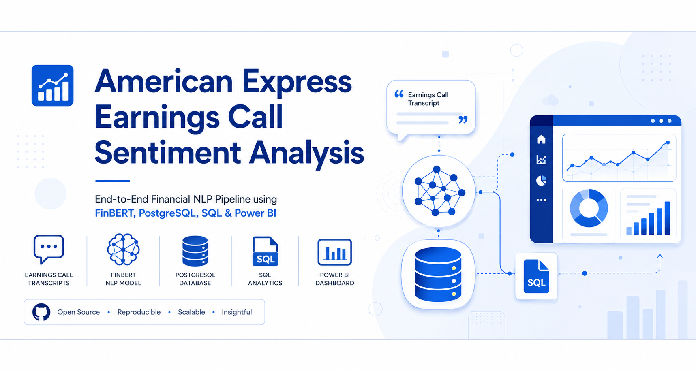
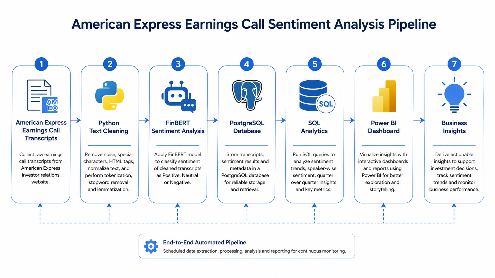
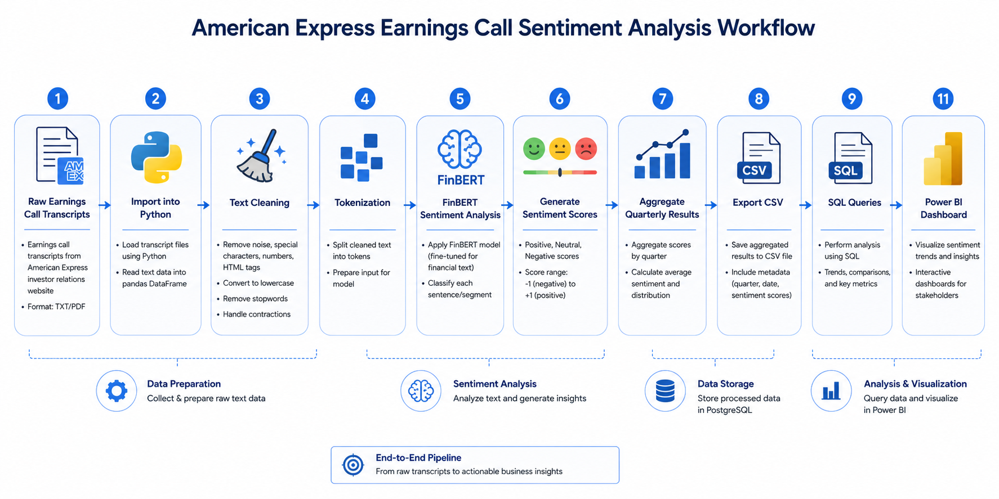
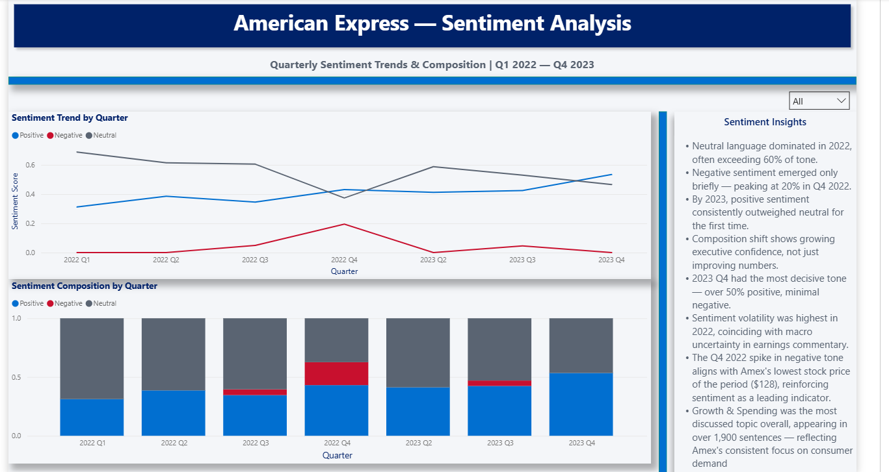
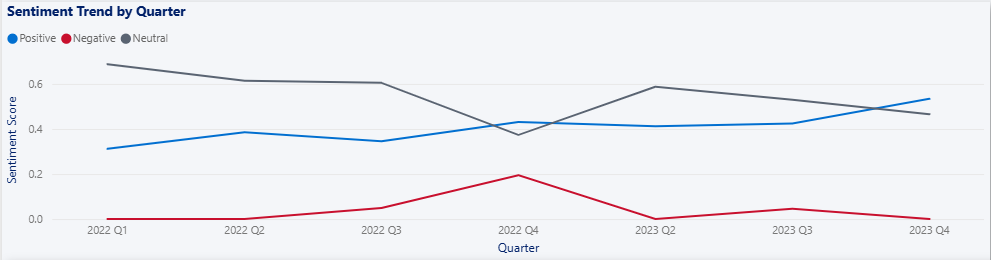
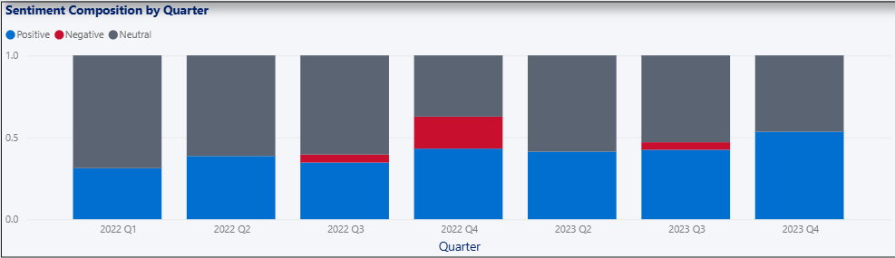
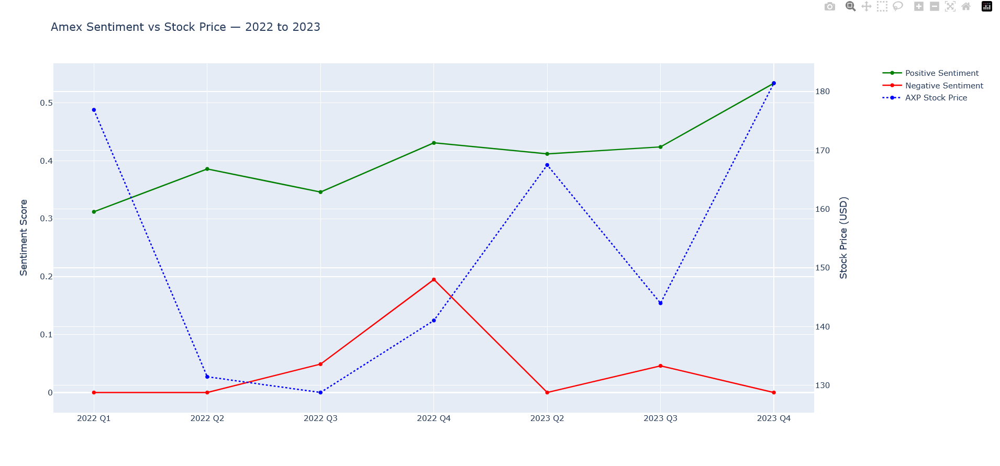
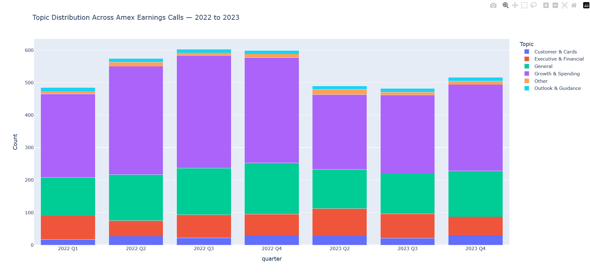

<p align="center">
  
</p>

<p align="center">
  
</p>

<h1 align="center">
American Express Earnings Call Sentiment Analysis
</h1>

<p align="center">
End-to-End Financial NLP Pipeline using <b>FinBERT</b>, <b>PostgreSQL</b>, <b>SQL</b>, and <b>Power BI</b>
</p>

<p align="center">


</p>

---

# 📖 Project Overview

This project performs **Financial Sentiment Analysis** on **American Express (NYSE: AXP)** quarterly earnings call transcripts from **2022–2023**.

Using **FinBERT**, earnings call transcripts are processed to classify financial sentiment into **Positive**, **Negative**, and **Neutral** categories. The processed data is stored in **PostgreSQL**, analyzed using SQL, and visualized in an interactive **Power BI dashboard**.

The project demonstrates an end-to-end data analytics workflow combining Natural Language Processing, database management, business intelligence, and financial analytics.

---

# 🎯 Objectives

- Analyze quarterly earnings call transcripts
- Perform financial sentiment analysis using FinBERT
- Compare quarterly sentiment trends
- Analyze dominant discussion topics
- Relate executive sentiment with stock performance
- Build an interactive Power BI dashboard

---

# 🛠 Tech Stack

| Category | Technology |
|-----------|------------|
| Programming | Python |
| NLP Model | FinBERT |
| Framework | Hugging Face Transformers |
| Database | PostgreSQL |
| Query Language | SQL |
| Dashboard | Microsoft Power BI |
| Notebook | Jupyter Notebook |
| Libraries | Pandas, NumPy, PyTorch, Plotly, SQLAlchemy |

---

# 🏗 System Architecture

<p align="center">

</p>

The architecture illustrates the complete analytics pipeline from raw earnings call transcripts to interactive business intelligence dashboards.

---

# 🔄 Project Workflow

<p align="center">

</p>

### Workflow

1. Collect quarterly earnings call transcripts
2. Clean and preprocess financial text
3. Perform sentiment analysis using FinBERT
4. Aggregate quarterly sentiment metrics
5. Store processed data in PostgreSQL
6. Execute SQL business analysis
7. Build interactive Power BI dashboards

---

# 📊 Dashboard Overview

<p align="center">

</p>

The dashboard provides an executive summary of quarterly sentiment, stock performance, business topics, and overall trends.

---

# 📈 Quarterly Sentiment

<p align="center">

</p>

Compares Positive, Neutral, and Negative sentiment across quarterly earnings calls.

---

# 📉 Sentiment Distribution

<p align="center">

</p>

Shows the distribution of financial sentiment detected by FinBERT throughout the analysis.

---

# 📈 Sentiment vs Stock Performance

<p align="center">

</p>

Compares quarterly executive sentiment with stock performance to explore potential relationships.

---

# 📊 Topic Distribution

<p align="center">

</p>

Highlights the most frequently discussed business topics identified during earnings calls.

---

# 🗂 Repository Structure

```text
american-express-earnings-call-sentiment-analysis/

├── assets/
├── data/
├── notebooks/
├── powerbi/
├── sql/
├── README.md
├── requirements.txt
├── LICENSE
└── .gitignore
```

---

# 🗄 Database

Processed data is stored in PostgreSQL using three primary tables:

- quarterly_summary
- sentiment_scores
- topic_distribution

---

# 🔍 Sample SQL Query

```sql
SELECT
    quarter,
    positive,
    negative,
    dominant_topic
FROM quarterly_summary
ORDER BY positive DESC;
```

---

# 📊 Key Insights

- Successfully analyzed earnings call transcripts using FinBERT.
- Identified quarterly shifts in executive sentiment.
- Measured relationships between management sentiment and stock performance.
- Extracted dominant business discussion topics.
- Built an executive Power BI dashboard for interactive analysis.

---

# 🚀 Installation

Clone the repository

```bash
git clone https://github.com/kpranay658/american-express-earnings-call-sentiment-analysis.git
```

Install dependencies

```bash
pip install -r requirements.txt
```

---

# ▶ Running the Project

1. Open the Jupyter Notebook.
2. Run all notebook cells.
3. Execute SQL scripts in PostgreSQL.
4. Open the Power BI dashboard.
5. Explore the interactive visualizations.

---

# 📌 Future Improvements

- Multi-company comparison
- Real-time earnings transcript ingestion
- Speaker-level sentiment analysis
- LLM-generated earnings summaries
- Predictive stock movement analysis
- Streamlit dashboard deployment

---

# 📚 Libraries

- pandas
- numpy
- transformers
- torch
- sqlalchemy
- psycopg2-binary
- plotly
- matplotlib

---

# 📄 License

Licensed under the MIT License.

---

# 👨‍💻 Author

**Pranay Kumar**

If you found this project helpful, consider giving it a ⭐ on GitHub.

## 👨‍💻 Author

**Pranay Kumar**

If you found this project useful, feel free to ⭐ the repository and connect with me on LinkedIn.
